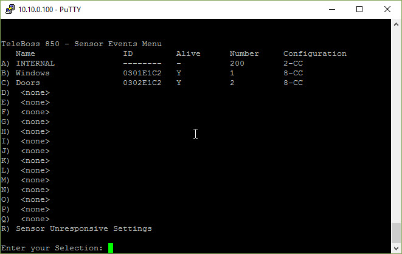
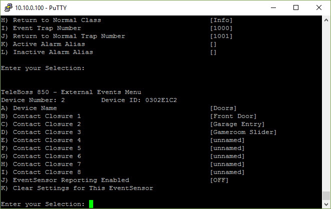
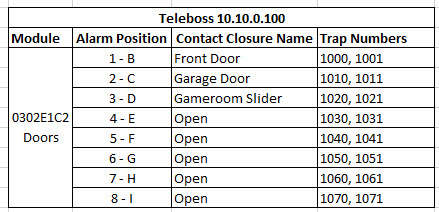
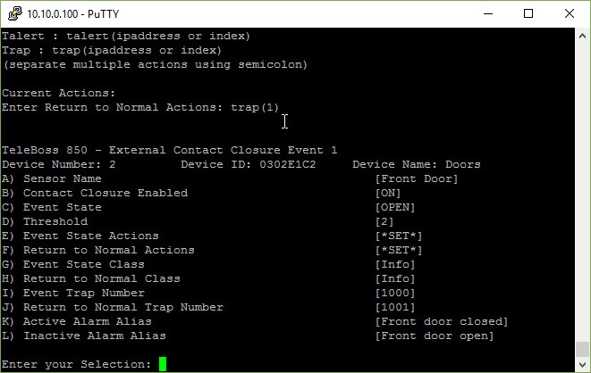
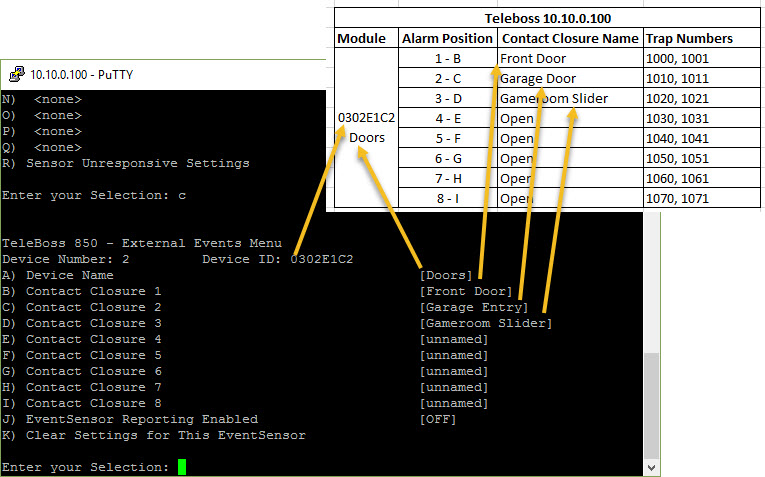
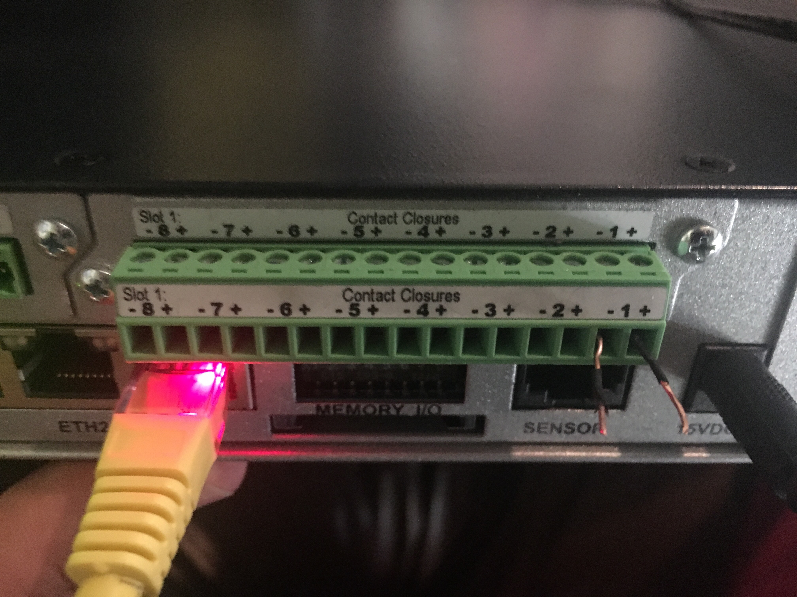
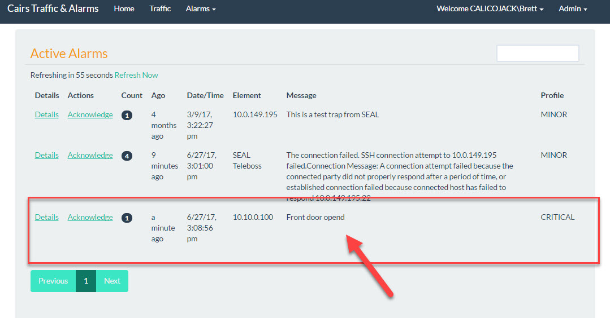
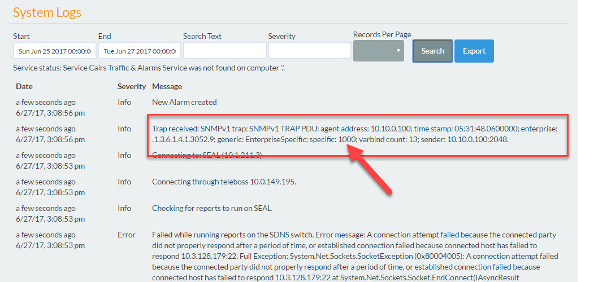

.. include:: /common/stub-variables.txt

Contact Closures
----------------

Authors:  `Brett Burbidge`_

This example will show to setup UTA to watch for contact closures through a Teleboss 850. 

Definitions
^^^^^^^^^^^

An **Alarm Element** is a managed device that sits on the network. In this example our **Alarm Element** is a Teleboss 850.  The Teleboss is the termination point for contact closures.  It monitors the state of the contact closures. When the state changes the teleboss sends a message to UTA. UTA recieves this message and translates it to the correct alarm. These messages are sent from the Teleboss to UTA via the Simple Network Management Protocol (SNMP) using SNMP Traps.  

The Teleboss sends specific information in each Trap to signal the contact closure state change.  These different Traps need to be defined in UTA.  They are called **Monitors**.  Each **Alarm Element** can have many **Monitors**

This example goes through how to setup an **Alarm Element** with its different **Monitors** to send the appriate alarms when the state of a contact closure changes.

Prerequisites
^^^^^^^^^^^^^

Before we start creating **Alarm Elements** and **Monitors** in the software we need to map out the different contact closures and where they sit in the Teleboss. Below is a screenshot of an Excel spreadsheet that contains the an example configuration.  We will go through each of these below.

 .. image:: images/teleboss_module.jpg

We will fill out the Trap Numbers later.

Click here to download an :download:`example configuration file <contact_closure_example.xlsx>` 

Each contact closure module in the teleboss can hold 8 contact closures.  When the state of the contact closure changes (from open to close, or close to open) a message with the corresponding ID (number) is sent out as an SNMP trap. We read this trap ID in UTA and create the correct alarm.  If the state of the contact closure is changed back to the default state, meaning the alarm has been corrected, we clear the alarm in UTA.  So we need two IDs for each contact closure.  An ID that sets the alarm and the ID that clear it.  You can see those in the image above. 

* Module: is the name of the module in the Teleboss.
* Alarm Position: is the physical location of the wires plugged into the back of the Teleboss.
* Contact Close Name: name of the contact closure.
* Trap Numbers: These are the ID's passed in the Trap that will create/acknowlege specific alarms in UTA.

.. hint:: Take a minute now and make your own spreadsheet with your site information. We will gather the **Monitor** Trap Numbers later.

Ensure UTA & Teleboss Connections
"""""""""""""""""""""""""""""""""
Follow the steps in :ref:`Teleboss Connection <teleboss-connection>`  before you continue.

Alarm Element Creation 
^^^^^^^^^^^^^^^^^^^^^^

Follow the steps below to create the Teleboss as an **Alarm Element** in UTA:

#. Open UTA & Login
#. Click the Admin dropdown
#. Select Alarm Elements
#. In the main window click the New Element button

Example: 

 .. image:: images/new_alarm_element.gif

Enter the Alarm Element information:

#. Name (the name of the Teleboss)
#. Ip Address (the ip address of the Teleboss)
#. Port (leave this blank)
#. Community Name (leave this blank)
#. Type (select Teleboss)
#. Collector Port (leave this blank)
#. Collection File Path (leave this blank)
#. SNMP Version (select 'one')
#. Click Save

This will send you back to the Alarm Elements screen

Finished Example:
 .. image:: images/uta_alarm_element.jpg

Element Monitors 
^^^^^^^^^^^^^^^^

**Monitors** are part of the **Alarm Element** that trigger alarms based on the ID recieved from the SNMP Trap.  This section will go through how to setup these in the Teleboss and in UTA.

.. note:: Make sure your excel spreadsheet is finished with your modules and contact closures defined.  

Before we start looking at UTA **Monitors** lets configure the Teleboss and fill out the rest of your excel sheet.

* Open Putty.exe and login to the teleboss
* After logging into the Teleboss via SSH type 'setup' and press Enter.

.. image:: images/putty_login.jpg

* Select option F (Action Defintions)

.. image:: images/putty_f.jpg

* Select option A (Hostname/IP Address 1)
* Enter the IP address of the UTA server
* Press the Enter button

.. image:: images/putty_a.jpg

* Press the Enter button to go back one more menu
* Select option E (Alarm/Event Defintions)
* Select option C (EventSensor Device Settings)

This will show you a list of the Teleboss EventSensor modules installed in the Teleboss.  

.. important:: It is very important!  !Muy Importante! The Alive column must have a Y.  If the Alive column has a N the EventSensor will NOT WORK!

If Alive is set to Y, continue to the next section. Before we do anymore setup make sure that Alive is set to Y. To fix an EventSensor with Alive set to N follow the steps below. 

* Select option B (or whatever card has an N in the Alive column)
* Select option K (Clear settings for this EventSensor)
* Press the enter button until you get out of the Setup menu in the Teleboss
* Type Restart and press Enter

After the Teleboss restarts the card should be Alive (Alive set to Y).

.. note:: If you don't have an C option here it means that the modules have not been installed or the device needs to be rebooted.

In the device above there are two modules (Windows and Dooors)

* Select an option. In this example I am going to click C (Contact Closure 2).  The screen will change to what you see below.  We are looking at the 8 contact closures on the Doors module.

Each Teleboss module has 8 possible contact closure connections. In the menu (shown above) you can see all 8 contact closures.  We are going to configure each of these according to the Excel spreadsheet we filled out earlier.

Name your Module
""""""""""""""""

* Select option A (Device Name)
* Enter the Module name you want here and then press the Enter key.  I will name mine 'Doors'.  

Configure the Module
""""""""""""""""""""

* Select option B (Contat Closure 1)

You should see something similar to this:

.. image:: images/putty_contact_closure_doors.jpg

The following list explains each of the items seen in this screen:

A. Sensor Name: Just a reference to the section name.
B. Contact Slosure Endabled: this contact closure is triggering when changes occure.
C. Event State: The default state of the contact closure connected.
D. Threshold: The amount of time (in seconds) that the contact closure state must be in.  For example if 2, the state must be 'closed' for 2 seconds for this to trigger a trap.
E. Event State Actions: What to do when the event state has changed.
F. Return to Normal Actions: What to do when the event state has been changed back to default state.
G. Event State Class: We don't use this but it can be seen on the Traps captured by UTA.
H. Return to Normal Class: We don't use this either.
I. Event Trap Number: IMPORTANT: This must be a Unique number for this whole Teleboss. This number tells UTA which alarm to trigger. 
J. Return to Normal Trap Number: IMPORTANT: This must be a Unique number for this whole Teleboss. This number tells UTA which alarm to turn off. 
K. Active Alarm Alias: Just text so you know what the active state is.  'Front door shut' in this example is the default state.
L. Inactive Alarm Alias: Just text so you know what the inactive state is.  'Front door open' in this example.\

Complete your Spreadsheet
"""""""""""""""""""""""""

In the image below I have entered the individual Event Trap Number and Return to Normal Trap Numbers in the spreadsheet.

.. note:: Remember that the Event Trap Number and Return to Normal Trap Number be unique for the entire Teleboss.

When completing your spreadsheet make sure to fill in each of the Trap Numbers for both Evnet Trap Number and Return to Normal Trap Number.  I normally just put them one digit apart as seen in the example above.

Configure your Contact Closure
""""""""""""""""""""""""""""""

Now we need to change each of the following contact closure properties to match your spreadsheet.  To do that enter the letter of the property you want to change.  Use the guide below to help.

* A: Sensor Name
* B: ON
* C: OPEN
* D: 2
* E: Press Enter and type trap(1) then press Enter.  Explanation below.
* F: Press Enter and type trap(1) then press Enter.
* G: Info
* H: Info
* I: 1000
* J: 1001
* K: Enter open status text that makes sense for this sensor
* L: Enter closed status text that makes sense for this sensor

Your complete screen should look similar to this:

.. note:  trap(1) tells the Teleboss to send a trap to the first ip address in Alarm/Event Definitions (we set this up above).

Configure the remaining Teleboss Modules Now
""""""""""""""""""""""""""""""""""""""""""""

Go through your Teleboss and set up each module and contact closure to match your spreadsheet.

Your spreadsheet and teleboss should look similar to this:

UTA Monitor Creation
^^^^^^^^^^^^^^^^^^^^

The UTA Alarm Monitors watch the contact closures you created in the Teleboss.  This section will cover adding the Alarm Monitors in UTA and testing the Alarm Creation.

#. Open UTA and Login.
#. Go to Admin>Alarm Elements.
#. Click the Monitors button on the Alarm Element you created earlier.
#. Click New Monitor.

Example:

.. image:: images/alarm_monitor_new.gif

With the new Alarm Monitor open fill out the information for this monitor.  

.. hint:: For each Contact Closure you configured in the Teleboss we need to create a new Alarm Monitor for each one. Fun!

* Name: the name of the contact closure from your excel spreadsheet.
* Alarm Key: the Trap Number you entered into the Teleboss.  The first number in the Trap Numbers column.
* Alarm Key Value: leave this blank.
* Clear Alarm Key: the Return to Normal Trap Number.  The second number in the Trap Numbers column.
* Clear Alarm Key Value: leave this blank.
* Message: this is the alarm message that will be displayed when an new alarm is generated from this.  For exampl this could be 'Back door open'.
* Escalation: select the Escalation pattern from the dropdown list.
* Press the Save button to save the Alarm Monitor.

Example:

.. image:: images/uta_alarm_monitor.jpg

Your Alarm Monitor is now ready to create alarms when the Teleboss sends a 1000 Trap message.  

Testing Contact Closures
^^^^^^^^^^^^^^^^^^^^^^^^

If you have the Teleboss installed and ready to receive contact closures from a real system skip to :ref:`Check UTA for Alarms <check-uta-for-alarms>`.

Create Contact Closure Test
"""""""""""""""""""""""""""

Most of the time we don’t have access to the systems that generate the contact closures during setup.  Follow the instructions below to create your own contact closure tester with the Teleboss.

Strip two wires on both sides and secure one side into the Teleboss module slot 1+ and slot 1-.

.. image:: images/teleboss_sample_contact_closure_1.jpg

Below is the module installed in the Teleboss.  The default state of the Front Door Alarm is open. This means that the current state is non alarming (pun not intended).   

To create an alarm close the circuit.  Closing the circuit will tell the Teleboss to send an SNMP Trap to the UTA server.

.. image:: images/teleboss_sample_contact_closure_closed.jpg

Check UTA for Alarms
""""""""""""""""""""
.. _check-uta-for-alarms:

#. Open UTA and Login.
#. Go to Alarms > Active Alarms.  
#. You should see an alarm that looks like this:

If you don’t see an alarm on the Active Alarms page we need to do some more troubleshooting.

Troubleshooting
"""""""""""""""

.. hint:: If you did not see an alarm in Active Alarms go back through each step above and ensure that IP’s, trap numbers are correct.  

Check the System Log for Traps
""""""""""""""""""""""""""""""

Go to Admin > System Logs and check for traps received.  You should see something like this:

.. important:: Make sure you touched the wires together for at least 2 seconds to create the alarm.  2 seconds comes from the Threshold setting found on the specific Contact Closure.

Finished
^^^^^^^^
This concludes the section on setting up Contact Closures.  Happy alarming.