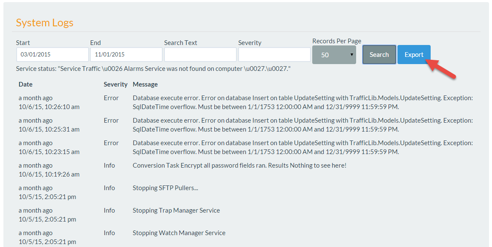

.. include:: /common/stub-variables.txt

Export System Logs
==================

Authors:  `Brett Burbidge`_

Introduction
^^^^^^^^^^^^

Below describes how to export the |product| system logs.  

#. Login and accept the warning screen.
#. Select the Admin menu (if you are not an Admin see this screen :ref:`change-user-profile`).
#. Select the System Log menu item.
#. Enter a Start and End Date, Search text (optional) and Severity (optional).
#. Select the Export button.

