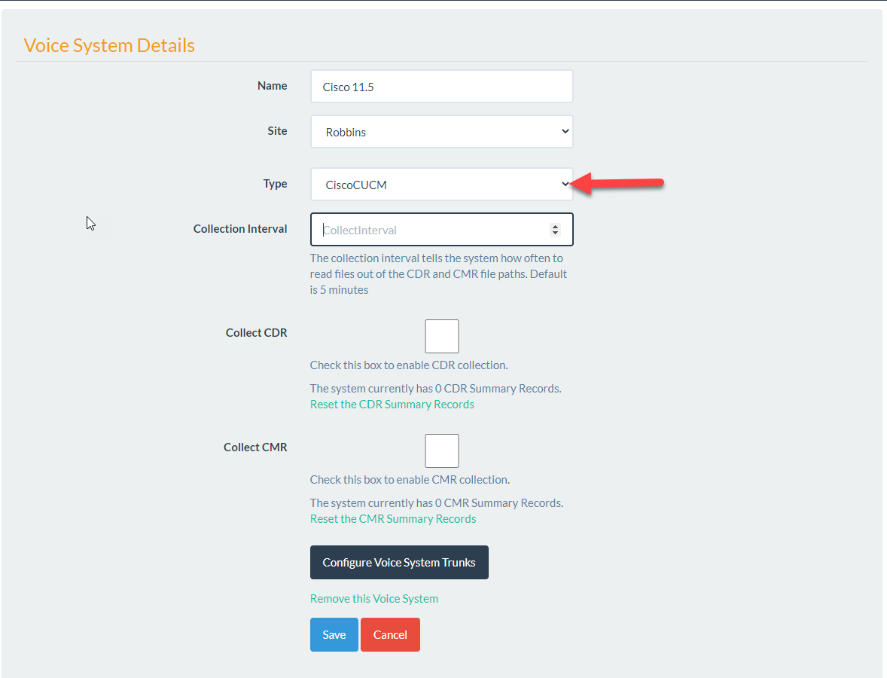

.. include:: /common/stub-variables.txt

Cisco CUCM
==========

The Cisco Voice System is the latest Telephone Switch added to the |product| suite. 

The Cisco CUCM does not produce the same types of reports as the Avaya CM.

.. note:: The Voice System for the Cisco CUCM gathers raw CDR and CMR files and produces traffic reports based on aggregates from this data.

To get started navigate to Admin/Voice Systems and click New Voice System. When the new Voice System screen is displayed fill out the basic information and select the **type** as CiscoCUCM. 

You will be presented with the options below.

In order to report on the CUCM traffic you must first setup the CDR and CMR collection. 

**Collection Interval**:  The collection interval tells the system how often to read files out of the CDR and CMR file paths. Default is 5 minutes.
**Collect CDR**: In order to start the collection of CDR check this box.  After checking this box you will be presented with the following options. 
    
    **CDR Folder Path**: If call records are on a local server drive enter the drive path here. This must be the fully qualified path on the UTA server for example C:\CDR\.
    
    **Delete CDR After Import**: If this is true the raw CDR file will be deleted from the folder 'C:\CDR\' after imported to the database. If false it will be moved into a folder called Processed in the same directory. 

.. important:: In order to setup CDR or CMR collection Devices must be setup to grab the raw data from the SFTP server. Read more in the Devices section.

Once the CMR and CDR options are selected you must press the Configure Voice System Trunks button.  **This is required for any CUCM reports to show on the UI**

The System Trunks allow you to configure which Voice System trunks will be added to your report and allow you to create custom names for these. 

Currently |product| uses the origSpan field as the "Trunk" field. In order to determine which "Trunks" to add to the Configure Trunks list use this SQL Query against the |product| Database. 

``select origSpan Trunk, count(*) Calls from CUCMCDR
Group by origSpan having count(*) > 5 order by Count(*) Desc``

This query will only show data if the call collection settings are complete in |product|. Once you see data use the "Trunk" as the "Trunk Name" value when configuring the Voice System Trunks. 

origSpan is defined in the CUCM Documentation as:

.. note:: **orgSpan** For calls that originate at a gateway, this field indicates the B-channel number of the T1, PRI, or BRI trunk where the call originates, or a zero value for FXS or FXO trunks. For H.323 gateways, the span number remains unknown, and this field contains the call leg ID of the originator. For calls that did not originate at a gateway, the value specifies zero. Default - This field gets populated based on these rules.

The Cisco CUCM CDR field definitions can be found here: https://www.cisco.com/c/en/us/td/docs/voice_ip_comm/cucm/service/11_5_1/cdrdef/cucm_b_cucm-cdr-administration-guide-1151/cucm_b_cucm-cdr-administration-guide-1151_chapter_0101.html
